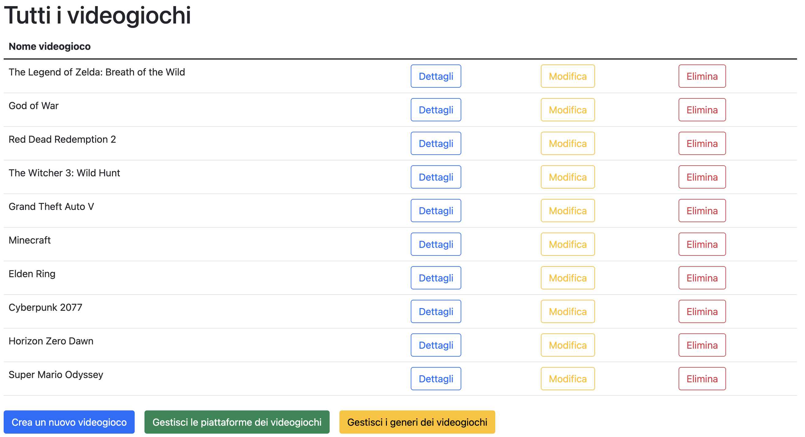

# Videogame Collection API

Questo progetto è il backend di una web-app per la gestione di una raccolta di videogiochi. Sviluppato con Laravel, gestisce la logica applicativa, il database e le API REST per il frontend React.

## ⚙️ Tecnologie utilizzate
- PHP
- Laravel
- MySQL
- Laravel Sanctum (opzionale, per autenticazione API)
- Composer

## 📦 Funzionalità principali
- CRUD completo per videogiochi (Create, Read, Update, Delete)
- Validazione dei dati lato server
- Organizzazione per categorie
- API RESTful per comunicazione con il frontend
- Gestione immagini tramite upload o URL

## 📁 Struttura del progetto
- `app/Models`: Modelli Eloquent (es. `Videogame.php`)
- `app/Http/Controllers`: Controller API
- `routes/api.php`: Rotte delle API
- `database/migrations`: Struttura del database
- `app/Http/Requests`: Validazioni dei dati in input

